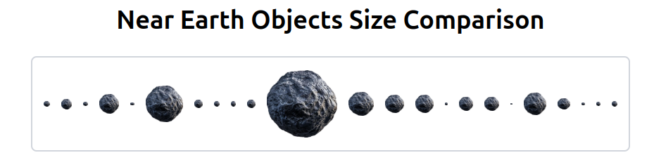
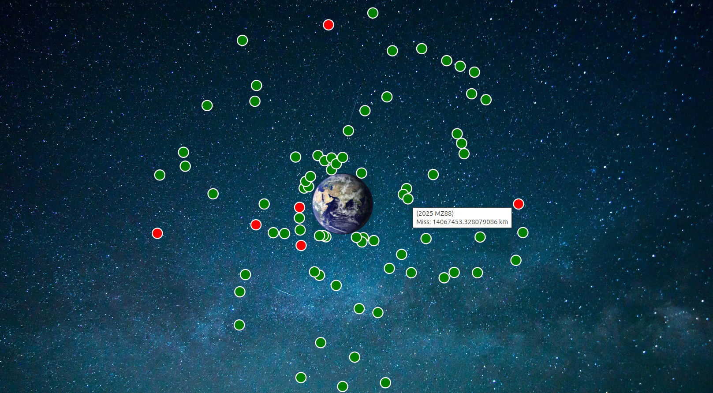
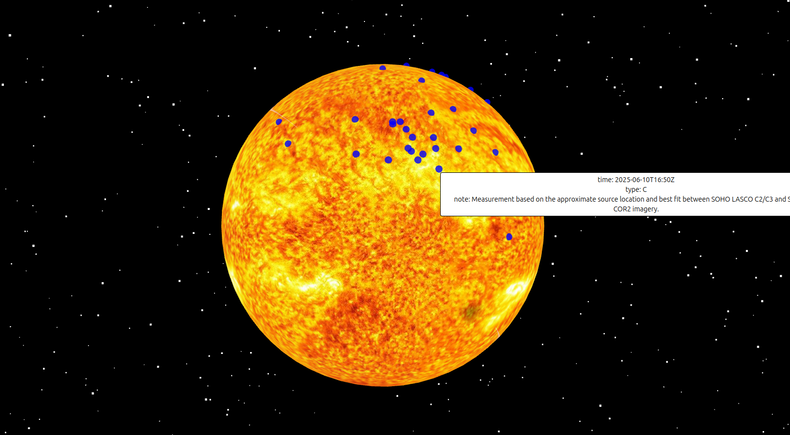

# nasa api coding challenge

## Details

This repository is for my submission to Bounce Insights coding challenge to create a React/Express data visualiation app showcasing space data from NASA's Open APIs. The app is built on a React/Express boilerplate written in TypeScript, originally developed by NASA software engineer @bfiest. This boilerplate generalises the architecture used in NASA's Mission Control app, github.com/nasa/coda.

Live Website -> https://nasa-api-coding-challenge.onrender.com/

## Endpoints Used

- Astronomy Picture of the Day (APOD)
- Near Earth Object Web Service (NeoWs)
- Space Weather Database Of Notifications, Knowledge, Information (DONKI)

## Features

### Astronomy Picture of the Day (APOD)

Date-based viewer – Browse NASA’s APOD database by selecting specific dates.

### Near-Earth Objects (NEOs)

Size comparison – Visualise NEO's dimensions over a customisable date range.



Close-approach visualiser by date range – Interactive D3.js visualisation of all the miss distances of NEOs passing by Earth during a custom time range. NEOs are displayed as green, while Potentially hazardous NEOs are shown as red.



Close-approach visualiser by NEO - Interactive D3.js visualisation of individual NEOs' miss distances from Earth over their lifetime.

### Coronal Mass Ejection (CME) Visualisation

3D CME map – Renders ejection locations on the surface of the sun using Three.js with date-range filtering.

Dynamic 3D starfield – Procedurally generated star background



### UI/UX Design

Fully responsive layout – Adapts seamlessly to all screen sizes

Error handling and edge cases - Date Range Form will not allow a range beyond NASA's limit

Loading state management - Adds placeholders while resources load

### Backend

RESTful API – GET/POST endpoints for data retrieval.

### Development

Test-driven development – Unit testing via Jest.

CI/CD pipeline – Automated linting, compilation, and testing on every commit. Pipeline must pass before merging into main.

Structured workflow – Feature branches with Linear integration for issue tracking.

Clear Commits - Gitmojis give commits a clear purpose

### Deployment

Production deployment - Deployed using Render

## Structure

- `./github`: Contains CI/CD jobs/actions
- `./src`: Contains source code
- `./src/components`:Contains React components
- `./src/components/ui` Contains Shadcn components
- `./src/components/neo` Contains React components for NEO visualisations
- `./src/components/cme` Contains React components for CME visualisations
- `./src/components/apod` Contains React components for APOD visualisations
- `./src/pages` Contains Front end pages
- `./src/public` Contains Static files
- `./src/server` Contains RESTful API server
- `./src/services` Contains helper functions for the RESTful API server
- `./src/tests` Contains unit tests
- `./src/typings` Contains types

## Run Locally

To run locally, use the following command

```
git clone https://github.com/Michael-Regan03/nasa-api-coding-challenge.git
npm install // installing dependencies
npm run dev
```

#### NOTE

Both Contributers on this project are me, Michael Regan

- **Michael-Regan03** personal email from PC
- **reganm25** university email from laptop
